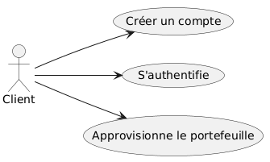

## 1. Introduction et Objectifs
BrokerX+ est une plateforme émergente de courtage en ligne qui souhaite moderniser son système de gestion des opérations de courtage pour répondre à la croissance de sa clientèle et aux exigences de fiabilité, sécurité et performance.

### Panorama des exigences 

BrokerX est une plateforme de courtage en ligne pour investisseurs particuliers. Cette application offre une interface de courtage moderne. En plus des buts de la phase1, cette deuxième phase a pour but de : 
- concevoir une architecture microservices orchestrée, exposée via une API Gateway,
- implémenter un prototype RESTful fonctionnel,
- assurer la qualité et l’observabilité avec logs structurés, métriques Prometheus et dashboards Grafana,
- assurer la qualité par les tests automatisés,

### Objectifs qualité

| Priorité | Objectif qualité | Scénario |
|----------|------------------|----------|
| 1 | **Testabilité** | Tests automatisés avec pytest ou cargo test pour toutes les fonctions et endpoints REST |
| 2 | **Déployabilité** | Pipeline CI/CD automatisé multi-services avec GitLab/GitHub et Docker Compose |
| 3 | **Maintenabilité** | Code simple et bien structuré pour faciliter l'évolution |
| 4 | **Observabilité et Performance** | Logs structurés, dashboards Grafana, métriques Prometheus, optimisation latence/P95, throughput et saturation |

### Parties prenantes (Stakeholders)
- Clients : utilisateurs via interface web/mobile.
- Opérations Back-Office : gestion des règlements, supervision.
- Conformité / Risque : surveillance pré- et post-trade.
- Fournisseurs de données de marché : cotations en temps réel.
- Bourses externes : simulateurs de marché pour routage d’ordres.​

## 2. Contraintes
| Contrainte | Description |
|------------|-------------|
| **Technologie** | Utilisation de Java/C++/Rust/... (pas de Python), Docker, et GitLab/GitHub CI/CD |
| **Déploiement** | Déploiement via conteneurs Docker Compose pour microservices + Gateway + observabilité |
| **PostgreSQL** | Base de données relationnelle pour chaque microservices |
| **Microservices** | Découpage du monolithe en services indépendants conteneurisés |
| **API Gateway** | Routage centralisé, CORS, sécurité, journaux d’accès |
| **Microservices** | Logs structurés, métriques Prometheus, dashboards Grafana |
| **Microservices** | oad balancing via NGINX/Traefik, caching Redis/mémoire |

## 3. Contexte et champ d'application
### 3.1 Contexte métier

Le système permet au client de : 
- Créer un compte
- S'authentifier
- Approvisionner son portfeuille

## 3.2 Contexte technique
- **Client** : *main.rs* - Application Rust CLI
- **Couche API** : RESTful API exposée via API Gateway, versionnée, JSON, erreurs normalisées
- **Couche base de données** : PostgreSQL pour chaque microservice
- **Communication** : Client → Gateway → Microservice → DB
- **Observabilité** : Prometheus pour métriques, Grafana pour dashboards, logs structurés JSON
- **Load balancing** : NGINX/Traefik pour distribuer la charge entre instances de microservices

## 4. Stratégie de solution 
La solution BrokerX+ s’appuie sur un monolithe modulaire en Phase 1. La phase 2 s'appuie sur un système en microservices, le Domain-Driven Design (DDD) et l’architecture hexagonale, garantissant testabilité, maintenabilité et évolutivité.

Pour proposer une solution qui suit ses attentes la, les étapes d'implémentation suivis sont les suivantes :
- Passage en endpoint et normalisation des réponses HTTP 
- Ajout de la doc API avec Swagger et OpenAPI
- Implémenter une sécurité minimal avec CORS
- Ajouter la persistance et l'intégrité grace à une migration reproductibles 
- Ajouter des logs structurés et les métrics Prometheus
- Définir les microservices
- Passage en microservices
- Déployer via Docker et CI/CD.
- Documenter les choix et structurer les ADR.

## 5. Vue du bloc de consctruction 
### 5.1 Diagramme de classes
Cette vue présente les principaux éléments métiers du système, ainsi que leurs relations.
Dans cette deuxième phase, on se concentre sur les trois meme cas d’utilisation qie la phase 1 : inscription, authentification et approvisionnement du portefeuille. Cela se traduit par deux grands ensembles : la gestion des clients et la gestion des portefeuilles.
Ainsi 2 bases de données sont gérées : 

### 5.2 Diagramme de paquetage

## 6. Vue d'exécution 
La phase 2 reprend la meme vu d'exécution que la phase 1, aucun UC n'a été ajouté par manque de temps. Le travail a été centré sur la division en microservices, l'observabilité et la persistance.
### 6.1 Description des 3 UC Must
#### UC1 - Inscription & Vérification d’identité
##### Objectif​
Permettre à un nouvel utilisateur de créer un compte sur la plateforme en fournissant ses
informations personnelles, de vérifier son identité selon les exigences réglementaires
(KYC/AML) et d’activer son accès à la plateforme. Ce cas établit la relation de confiance initiale
entre l’utilisateur et BrokerX.

- Acteur principal : Client​
- Déclencheur : L’utilisateur souhaite créer un compte.
​- Pré-conditions : Aucune.​
- Postconditions (succès) : Compte créé en état *Pending* et changer à *Active* après validation.​
- Postconditions (échec) : Compte non créé ou marqué *Rejected* avec raison.

##### Scénarios 
###### Scénario principal
- Le Client fournit nom email,téléphone.
- Le système créer un compte en demandant le nom d'utilisateur ainsi que le mot de passe. Par la suite le système créer un portfeuille qui sera rataché à ce compte.
- Validation des données, création d'un compte en *Pending* et envoie du lien de vérification (pour la phase 1 on simule un token). 
- Le client confirme le lien OTP/MFA (retape le token)
- Le système passe le compte en *Actif* 

###### Scénarion alternatifs 
- email déjà existant → rejet, proposition de récupération de compte
- vérification d'email non complétée → le compte reste en Pending (rappel, expiration après X jours)

#### UC2 - Authentification & MFA
##### Objectif 
Garantir un accès sécurisé à la plateforme en permettant aux clients de s’authentifier avec identifiant/mot de passe et, le cas échéant, via un mécanisme de multi-facteurs (OTP, TOTP, WebAuthn). Ce cas protège les comptes contre les accès non autorisés.

##### Scénario
###### Scénario principal
- le Client saisit identifiant/mot de passe.,
- le Système valide,
- si MFA activée/obligatoire, le Système demande OTP (phase 1 on simule un token),
- le Client valide l’OTP,
- le Système émet le jeton de session, enregistre l’audit (IP, device, succès).​

###### Scénarion alternatif
- mot de passe incorrect → accès refusé
- MFA echoue (3 tentatives) → prochaine tentative avec X unité de temps
- Code MFA expiré ou invalide → retenter une connexion
- Compte suspendu → accès refusé

#### UC3 - Approvisionnement du portefeuille (dépôt virtuel) 
##### Objectif
Donner aux utilisateurs la possibilité de créditer leur portefeuille virtuel en effectuant des
dépôts simulés, afin de disposer de liquidités nécessaires pour placer des ordres d’achat. Ce cas assure la disponibilité des fonds pour les opérations boursières.

- Acteur principal : Client​
- Secondaires : Service Paiement Simulé / Back-Office​
- Déclencheur : Le Client crédite son solde en monnaie fiduciaire simulée.​
- Préconditions : Compte Active.​
- Postconditions (succès) : Solde augmenté, écriture comptable ajoutée.​
- Postconditions (échec) : Solde inchangé.

##### Scénarios
###### Scénario principale
- le client saisit le montant,
- le système valide limites (min/max, anti-fraude),
- le système crée une transaction *Pending*,
- le service Paiement Simulé répond *Settled*,​
- le système crédite le portefeuille, journalise et notifie.​

###### Scénario alternatif
- paiement rejeté → état *Failed*, notification avec motif
- idempotence → si retry reçu avec même idempotency-key, renvoyer le résultat précédent 

### 6.2 MoSCoW
#### Must  
1. Inscription & Vérification d’identité
→ Sans inscription, aucun utilisateur ne peut exister.

2. Authentification & MFA
→ Sécurité de base, exigence critique.

3. Approvisionnement du portefeuille (dépôt virtuel)
→ Indispensable pour préparer les ordres futurs.

#### Should 
Placement d’un ordre (marché/limite) avec contrôles pré-trade : 
- Important pour montrer le cœur métier, mais dépend du portefeuille déjà approvisionné.

#### Could
Abonnement aux données de marché
- Apporte de la valeur, mais pas nécessaire pour démontrer la faisabilité de base.

Modification / Annulation d’un ordre
- Amélioration UX, mais seulement utile si le placement d’ordre est déjà en place.

#### Won't 
Appariement interne & Exécution (matching)
- Très complexe, plutôt pour Phase 2/3 avec microservices.

Confirmation d’exécution & Notifications
- Dépend du matching, donc hors périmètre Phase 1.
  
## 7. Vue de déploiement
Cette vue montre comment le système est déployé techniquement.
La phase 2 présente un déploiement technique différent de celui de la phase 1. En effet, on adopte une architecture microservices conteneurisée orchestrée par une API Gateway. Chaque microservice est encapsulé dans son propre conteneur Docker, ce qui permet une isolation complète, une scalabilité horizontale et un déploiement indépendant. 

Le flux typique d'une requete dans cette nouvelle architecture est le suivant : 
    Client → API Gateway → Microservice → DB

1. Le client envoie une requête REST vers l’API Gateway.
2. La Gateway authentifie et valide la requête, puis la route vers le microservice correspondant.
3. Le microservice traite la requête en interagissant avec sa base de données PostgreSQL
4. La réponse est renvoyée à travers la Gateway vers le client.
5. Tous les appels sont journalisés et les métriques collectées pour observabilité et analyse de performance.
   

## 8. Concepts transversaux
### 8.1 ORM(diesel)
Un ORM (Object-Relational Mapping) comme Diesel en Rust permet de travailler avec la base de données PostgreSQL en utilisant des objets Rust au lieu d’écrire directement du SQL.
- Cela rend le code plus sûr et moins sujet aux erreurs.
- Les changements dans la base peuvent être suivis grâce aux migrations.
- Le code métier n’a pas besoin de connaître les détails SQL.

### 8.2 DTO 
Les DTOs servent à transférer les données entre le cœur du programme et le reste (interface, stockage…).
- Ils permettent de protéger certaines informations sensibles.
- Ils simplifient l’envoi et la réception des données.

Par exemple, pour afficher un client, on peut utiliser un DTO qui contient juste le nom et l’email, et pas le mot de passe.

### 8.3 Architecture hexagonal 
Chaque microservice applique l’architecture hexagonale, séparant clairement le domaine métier des dépendances externes :
- Adaptateurs pour la base de données, les caches, ou les interfaces REST
- Port et interfaces pour exposer les fonctionnalités métier et recevoir les requêtes

### 8.4 RESTful API 
Chaque service expose une API RESTful versionnée : 
- Format JSON pour les requêtes et réponses
- Codes HTTP normalisés pour signaler le succès, l’échec ou les erreurs
- Gestion d’erreurs centralisée et normalisée, avec messages clairs et traçables

### 8.5 Sécruité API
Pour sécuriser les endpoints on utilise : 
- JWT pour authentification et autorisation
- CORS configuré côté Gateway et services

### Observabilité
Chaque service implémente l’observabilité :
- Logs structurés JSON, centralisés
- Métriques applicatives et système collectées par Prometheus
- Dashboards Grafana pour visualiser les 4 Golden Signals : latence, débit, erreurs et saturation

### Caching

Endpoints coûteux ou fréquemment sollicités utilisent le cache mémoire pour réduire la charge sur les bases de données et améliorer les temps de réponse. Les règles d’expiration et d’invalidation sont définies par service.

### Load Balancing

Les instances multiples de chaque microservice sont accessibles via NGINX ou Traefik, qui distribuent la charge et assurent la tolérance aux pannes et la haute disponibilité. Le routage et le load balancing sont configurés pour permettre des scénarios de scalabilité horizontale et tests de performance.

## 9. Décisions architecturales
### ADR-001 : Style d'architecture
#### Statut
Accepté 
#### Mise à jour 
Compatible microservices et REST.

#### Décision
Le monolithique de la phase 1 est migré vers une architecture microservices, chaque service applique le DDD et une architecture hexagonale. 

### ADR-002 : Choix de la persistance
#### Statut
Accepté 
#### Mise à jour 
Chaque microservice possède sa propre base PostgreSQL et schéma dédié. Diesel reste l’ORM pour gérer les entités et les migrations.
  
### ADR-003 : Gestion des erreurs et idempotence des opérations
#### Statut
Accepté 
#### Mise à jour 
- Idempotence appliquée à tous les endpoints critiques
- Erreurs REST sont normalisées et traçables

### ADR-004 : Découpage en microservices
#### Statut
Accepté 
#### Contexte 
Le monolithe de la phase 1 est difficile à scaler et à maintenir sous de forte charge.

#### Décision
Découpage en microservices indépendants : Portefeuilles/Stocks, Compte client.

#### Conséquences
Scalabilité horizontale, isolation des responsabilités, testabilité accrue, possibilité de déploiement indépendant par service.

### ADR-005 : API Gateway
#### Statut
Accepté 
#### Contexte 
Gestion centralisée des appels clients, sécurité, routage et monitoring.

#### Décision
Mise en place de Kong/KrakenD/Spring Cloud Gateway pour :
- Routage dynamique vers microservices
- Gestion CORS et JWT
- Journaux d’accès

#### Conséquences
Point unique d’accès et de sécurité, simplifie l’observabilité et le monitoring des requêtes.

### ADR-006 : Observabilité et performance
#### Statut
Accepté 
#### Contexte 
Nous avons besoin de mesurer les 4 Golden Signals, d'identifier les goulots d’étranglement et d'optimiser les endpoints critiques.

#### Décision
- Logs structurés JSON centralisés
- Métriques Prometheus exposées par service
- Dashboards Grafana pour latence, débit, erreurs et saturation
- Endpoints coûteux mis en cache
- Load balancing via NGINX/Traefik

#### Conséquences
Visibilité opérationnelle accrue, analyse sous charge, capacité à optimiser la performance et la scalabilité des microservices.

## 10. Exigence de qualité
### 10.1 Maintenabilité
- **Code organisé et documenté** : structure modulaire, conventions de nommage homogènes et documentation générée (template arc42) 
- **Traçabilité des décisions** : les choix structurants sont consignés dans des ADR, couvrant la migration vers microservices, l’API REST, la Gateway et l’observabilité.
- **Tests automatisés** : tests intégrée au pipeline CI pour détecter rapidement les régressions.

### 10.2 Flexibilité 
- **Architecture hexagonale** : chaque microservice isole le domaine métier des dépendances techniques (base de données, cache, services externes), ce qui permet de remplacer ou d’ajouter des adaptateurs sans modifier la logique métier.
- **Patrons de conception** : usage de Diesel ORM et de DTOs pour découpler persistance, transport et logique métier dans chaque service.
- **Couches indépendantes** : séparation claire entre domaine, application, infrastructure et API REST, facilitant l’intégration de nouveaux cas d’utilisation ou règles métier.
- **Paramétrage par configuration** : variables d’environnement Docker pour chaque service, Gateway et observabilité, rendant le système adaptable.
- **Sécurité REST** : JWT pour authentification et autorisation, CORS configuré via Gateway, validation et assainissement strict des entrées pour tous les endpoints.

### 10.3 Evolutivité
- **Base de données PostgreSQL** : chaque microservice peut disposer de son propre schéma ou cluster, garantissant scalabilité et isolation des données.
- **Monolithe modulaire** : découpage logique en services indépendants, permettant le scaling horizontal par service.
- **CI/CD et conteneurisation** : le pipeline GitLab/GitHub automatise build, tests et déploiement, garantissant la reproductibilité.
- **Anticipation des évolutions fonctionnelles** : le DDD rend possible l’ajout progressif de nouveaux UC sans refactor massif du domaine existant.
- **Load balancing et tolérance aux pannes** : NGINX/Traefik distribue la charge entre instances multiples de chaque service, garantissant haute disponibilité et performance.
- **Observabilité opérationnelle** : logs structurés, métriques Prometheus, dashboards Grafana permettant de suivre les 4 Golden Signals (latence, débit, erreurs, saturation) et d’identifier rapidement les goulots d’étranglement.
- **Caching** : endpoints critiques mis en cache, améliorant latence et débit sous charge.

## 11. Risque et dette techniques
### 11.1 Risque techniques
**Scalabilité limitée** : le monolithe pourrait devenir difficile à gérer si le nombre de transactions augmente fortement.

### 11.2 Dettes techniques
Pas encore de couche API HTTP : la communication directe Rust → PostgreSQL simplifie la phase 1 mais limite l’interopérabilité.

## 12. Glossaires
### Glossaire Métier

| Terme | Définition |
|-------|------------|
| **Back-Office** | Équipe ou système gérant les opérations internes de règlement, supervision et conformité |
| **Client** | Utilisateur de la plateforme |
| **Compte** | Identité numérique du client, utilisée pour l’inscription, l’authentification et la gestion de son portefeuille |
| **Conformité / Risque** | Processus de surveillance des transactions avant (pré-trade) et après (post-trade) leur exécution |
| **Fournisseurs de données de marché** | Entités fournissant des cotations en temps réel (prix des actifs) |
| **Gestion de portefeuille** | Fonctionnalité permettant au client d’approvisionner et de suivre ses fonds |
| **Portefeuille** | Compte financier détenu par un client, contenant des fonds et des transactions |
| **Transaction** | Opération financière réalisée par un client (ex. dépôt, retrait, achat/vente d’actif)|
| **Stakeholder (Partie prenante)** | Acteur ayant un intérêt ou une influence dans le projet |
| **Microservice** | Service logiciel autonome, responsable d’un domaine métier précis, pouvant être développé, déployé et scalé indépendamment |
| **REST** | Style architectural pour les API, utilisant HTTP, verbes standard (GET, POST, PUT, DELETE) et des représentations de ressources (JSON) | 
| **API Gateway** | Composant central qui expose et sécurise les API, gère le routage vers les microservices, les quotas, le throttling et les logs |

### Glossaire Technique

| Terme | Définition |
|-------|------------|
| **ADR (Architectural Decision Record)** | Document décrivant une décision architecturale importante et sa justification. |
| **Architecture hexagonale** | Modèle favorisant la séparation entre le domaine métier, les interfaces et les systèmes externes. |
| **CI/CD** | Pratiques d’intégration et déploiement continus, automatisant tests et livraison logicielle. |
| **Conteneur Docker** | Environnement isolé pour exécuter des applications et leurs dépendances. |
| **Contrainte technologique** | Limitation imposée au projet (Rust, Docker, PostgreSQL, etc.). |
| **Diesel (ORM)** | Librairie Rust pour interagir avec une base de données relationnelle. |
| **Domain-Driven Design (DDD)** | Méthodologie structurant le code autour du domaine métier et de ses règles. |
| **Évolutivité** | Capacité d’un système à croître sans perte de performance. |
| **Flexibilité** | Capacité d’un système à s’adapter rapidement aux évolutions. |
| **GitLab/GitHub** | Plateformes de gestion de code source et de pipelines CI/CD. |
| **Idempotence** | Propriété d’une opération répétée sans effet supplémentaire. |
| **Maintenabilité** | Facilité à modifier, améliorer ou corriger le code. |
| **Monolithe** | Architecture où toutes les fonctionnalités sont regroupées dans une seule application. |
| **ORM (Object-Relational Mapping)** | Technique de manipulation d’une base relationnelle via des objets du langage. |
| **DTO (Object Transfert Data)** | Technique de transport de donnée entre le domaine et les couches externes |
| **Patron de conception** | Solution réutilisable à un problème de conception logiciel récurrent. |
| **Pipeline** | Suite d’étapes automatisées pour tester, intégrer et déployer du code. |
| **PostgreSQL** | Système de gestion de base de données relationnelle. |
| **Sécurité** | Mesures de protection des données et transactions des clients. |
| **Testabilité** | Capacité à écrire et exécuter facilement des tests automatisés. |
| **RESTful API** | API respectant les principes REST, utilisant JSON et des codes HTTP normalisés |
| **JWT (JSON Web Token)** | Jeton utilisé pour authentifier et autoriser les utilisateurs auprès des API |
| **CORS (Cross-Origin Resource Sharing)** | Politique de sécurité HTTP contrôlant les ressources accessibles depuis un autre domaine |
| **Prometheus** | Outil de collecte et stockage de métriques pour la surveillance des applications et systèmes |
| **Grafana** | Outil de visualisation de métriques et création de dashboards pour monitoring et observabilité |
| **4 Golden Signals** | Principaux indicateurs de performance : latence, trafic (throughput), erreurs, saturation |
| **Load Balancing** | Technique de répartition de la charge entre plusieurs instances d’un service pour assurer la haute disponibilité et optimiser la performance |

# Guide d'exploitation
## Prérequis
Avant de commencer, assurez-vous d’avoir installé Git, Docker, et Rust.
Ces outils permettent de cloner le projet, exécuter l’application dans un conteneur et compiler. 

- Logiciel :   
    - Git
    - Docker et Docker compose 
    - Rust toolchain (version stable, inclut cargo)
  
Verifier l'installation : 
- git --version 
- docker --version 
- cargo --version
- 
## Cloner le projet 
Pour accéder à l'application, il faut cloner le projet. Pour cela utiliser la commande : 

clone avec ssh :
  - git clone git@github.com:Nadaya/projet_BrokerX.git
  
clone avec http : 
  - git clone https://github.com/Nadaya/projet_BrokerX.git

Enfin se placer dans le répertoire : **cd BorkerX**

## Lancer l'application avec Docker
Démarrer l'application et la base de donnée avec Docker à la racine du projet : **docker compose up --build**

Cela permet de lancer : 
- db : PostgreSQL
- application : binaire Rust compilé

Enfin pour lancer chaque service dans 2 terminals : 
- Premier terminal : docker exec -it portefeuille_service /bin/sh
- Deuxième terminal : docker exec -it account_service /bin/sh

Vous pourrez lancer : 
- localhost:8080 et localhost:8081 pour les 2 services 
- localhost:9090 pour Prometheus
- localhost:3000 pour Grafana
