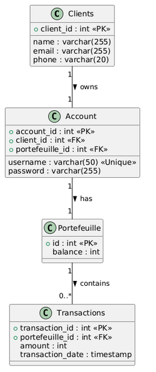
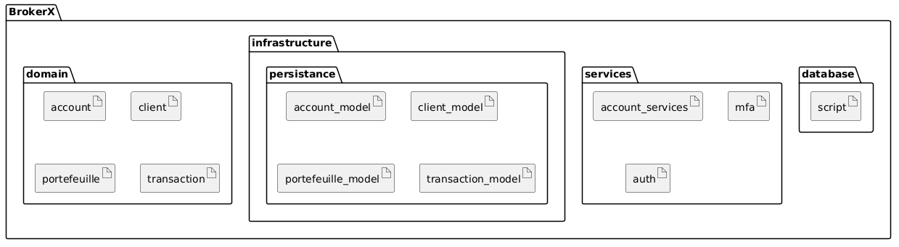
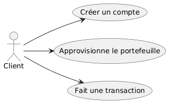
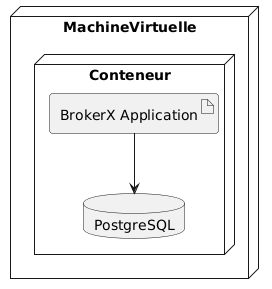

# 1. Introduction et Objectifs
BrokerX+ est une plateforme émergente de courtage en ligne qui souhaite moderniser son système de gestion des opérations de courtage pour répondre à la croissance de sa clientèle et aux exigences de fiabilité, sécurité et performance.

## Panorama des exigences 

BrokerX est une plateforme de courtage en ligne pour investisseurs particuliers. Cette application offre une interface de courtage moderne. Cette première phase a pour but de : 
- concevoir une architecture monolithique évolutive,
- appliquer les principes du Domain-Driven Design,
- mettre en oeuvre des patron de conceptions adaptés, 
- concevoir une solution de persistance robuste et fiable,
- documenter et justifier les choix architecturaux,
- implémenter un prototype réaliste et fonctionnel,git push -u origin main
- assurer la qualité par les tests automatisés,
- mettre en place et enrichir les pratiques DevOps.

## Objectifs qualité

| Priorité | Objectif qualité | Scénario |
|----------|------------------|----------|
| 1 | **Testabilité** | Tests automatisés avec pytest pour toutes les fonctions |
| 2 | **Déployabilité** | Pipeline CI/CD automatisé avec GitLab/GitHub |
| 3 | **Maintenabilité** | Code simple et bien structuré pour faciliter l'évolution |

## Parties prenantes (Stakeholders)
- Clients : utilisateurs via interface web/mobile.
- Opérations Back-Office : gestion des règlements, supervision.
- Conformité / Risque : surveillance pré- et post-trade.
- Fournisseurs de données de marché : cotations en temps réel.
- Bourses externes : simulateurs de marché pour routage d’ordres.​

# 2. Contraintes
| Contrainte | Description |
|------------|-------------|
| **Technologie** | Utilisation de Java/C++/Rust/... (pas de Python), Docker, et GitLab/GitHub CI/CD |
| **Déploiement** | Déploiement via conteneur Docker et pipeline GitLab/GitHub |
| **PostgreSQL** | Base de données relationnelle|
| **Monolithe initial** | Architecture monolithique Phase 1 |

# 3. Contexte et champ d'application
## 3.1 Contexte métier

Le système permet au client de : 
- créer un compte
- approvisionner son portfeuille

## 3.2 Contexte technique
- **Client** : *main.rs* - Application Rust CLI
- **Couche base de données** : Backend PostgreSQL
- **Communication** : Communication direct entre l'application Rust et la base de données, via la librairie diesel (pas de couche API HTTP)

# 4. Stratégie de solution 

# 5. Vue du bloc de consctruction 
## 5.1 Diagramme de classes

## 5.2 Diagramme de paquetage

# 6. Vue d'exécution 

# 7. Vue de déploiement

# 8. Concepts transversaux

# 9. Décisions architecturales

# 10. Exigence de qualité

# 11. Risque et dette techniques

# 12. Glossaires
| Terme | Definition (contexte métier) |
|----------|---------------------|
| **CLI** | Command-line interface : application d'interface de ligne de commande | 
| **Client** | Personne inscrite sur la plateforme. |
| **Compte** | Identifiants et informations d’accès associés à un Client |
| **Authentification** | Vérification des identifiants du Client (mot de passe) |
| **MFA (Multi-Factor Authentification)** | Vérification supplémentaire (OTP, email ou SMS) |
| **PorteFeuille** | Compte financier virtuel lié à un Client, exprimé dans une devise |
| **Solde** | Montant disponible dans un portefeuille | 
| **Transaction** | Mouvement financier enregistré (ex. dépôt) | 
| **Dépot** | Crédit du portefeuille d’un client, augmentant son solde | 