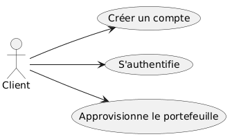

## 1. Introduction et Objectifs
BrokerX+ est une plateforme émergente de courtage en ligne qui souhaite moderniser son système de gestion des opérations de courtage pour répondre à la croissance de sa clientèle et aux exigences de fiabilité, sécurité et performance.

### Panorama des exigences 

BrokerX est une plateforme de courtage en ligne pour investisseurs particuliers. Cette application offre une interface de courtage moderne. Cette première phase a pour but de : 
- concevoir une architecture monolithique évolutive,
- appliquer les principes du Domain-Driven Design,
- mettre en oeuvre des patron de conceptions adaptés, 
- concevoir une solution de persistance robuste et fiable,
- documenter et justifier les choix architecturaux,
- implémenter un prototype réaliste et fonctionnel,git push -u origin main
- assurer la qualité par les tests automatisés,
- mettre en place et enrichir les pratiques DevOps.

### Objectifs qualité

| Priorité | Objectif qualité | Scénario |
|----------|------------------|----------|
| 1 | **Testabilité** | Tests automatisés avec pytest pour toutes les fonctions |
| 2 | **Déployabilité** | Pipeline CI/CD automatisé avec GitLab/GitHub |
| 3 | **Maintenabilité** | Code simple et bien structuré pour faciliter l'évolution |

### Parties prenantes (Stakeholders)
- Clients : utilisateurs via interface web/mobile.
- Opérations Back-Office : gestion des règlements, supervision.
- Conformité / Risque : surveillance pré- et post-trade.
- Fournisseurs de données de marché : cotations en temps réel.
- Bourses externes : simulateurs de marché pour routage d’ordres.​

## 2. Contraintes
| Contrainte | Description |
|------------|-------------|
| **Technologie** | Utilisation de Java/C++/Rust/... (pas de Python), Docker, et GitLab/GitHub CI/CD |
| **Déploiement** | Déploiement via conteneur Docker et pipeline GitLab/GitHub |
| **PostgreSQL** | Base de données relationnelle|
| **Monolithe initial** | Architecture monolithique Phase 1 |

## 3. Contexte et champ d'application
### 3.1 Contexte métier

Le système permet au client de : 
- Créer un compte
- S'authentifier
- Approvisionner son portfeuille

## 3.2 Contexte technique
- **Client** : *main.rs* - Application Rust CLI
- **Couche base de données** : Backend PostgreSQL
- **Communication** : Communication direct entre l'application Rust et la base de données, via la librairie diesel (pas de couche API HTTP)

## 4. Stratégie de solution 
La solution BrokerX+ s’appuie sur un monolithe modulaire, le Domain-Driven Design (DDD) et l’architecture hexagonale, garantissant testabilité, maintenabilité et évolutivité.

Pour proposer une solution qui suit ses attentes la, les étapes d'implémentation suivis sont les suivantes :
- Définir les modules métier et interfaces.
- Implémenter les cas d’usage prioritaires (inscription, authentification, approvisionnement).
- Mettre en place la persistance et les tests automatisés.
- Déployer via Docker et CI/CD.
- Documenter les choix et structurer les ADR.

## 5. Vue du bloc de consctruction 
### 5.1 Diagramme de classes
Cette vue présente les principaux éléments métiers du système, ainsi que leurs relations.
Dans cette première phase, on se concentre sur trois cas d’utilisation prioritaires : inscription, authentification et approvisionnement du portefeuille. Cela se traduit par deux grands ensembles : la gestion des clients et la gestion des portefeuilles.

Ici, le client est l’élément central : il possède un compte pour s’authentifier et un portefeuille pour stocker ses fonds. Chaque portefeuille contient une suite de transactions qui permettent de retracer son historique.

### 5.2 Diagramme de paquetage

## 6. Vue d'exécution 
### 6.1 Description des 3 UC Must
#### UC1 - Inscription & Vérification d’identité
##### Objectif​
Permettre à un nouvel utilisateur de créer un compte sur la plateforme en fournissant ses
informations personnelles, de vérifier son identité selon les exigences réglementaires
(KYC/AML) et d’activer son accès à la plateforme. Ce cas établit la relation de confiance initiale
entre l’utilisateur et BrokerX.

- Acteur principal : Client​
- Déclencheur : L’utilisateur souhaite créer un compte.
​- Pré-conditions : Aucune.​
- Postconditions (succès) : Compte créé en état *Pending* et changer à *Active* après validation.​
- Postconditions (échec) : Compte non créé ou marqué *Rejected* avec raison.

##### Scénarios 
###### Scénario principal
- Le Client fournit nom email,téléphone.
- Le système créer un compte en demandant le nom d'utilisateur ainsi que le mot de passe. Par la suite le système créer un portfeuille qui sera rataché à ce compte.
- Validation des données, création d'un compte en *Pending* et envoie du lien de vérification (pour la phase 1 on simule un token). 
- Le client confirme le lien OTP/MFA (retape le token)
- Le système passe le compte en *Actif* 

###### Scénarion alternatifs 
- email déjà existant → rejet, proposition de récupération de compte
- vérification d'email non complétée → le compte reste en Pending (rappel, expiration après X jours)

#### UC2 - Authentification & MFA
##### Objectif 
Garantir un accès sécurisé à la plateforme en permettant aux clients de s’authentifier avec identifiant/mot de passe et, le cas échéant, via un mécanisme de multi-facteurs (OTP, TOTP, WebAuthn). Ce cas protège les comptes contre les accès non autorisés.

##### Scénario
###### Scénario principal
- le Client saisit identifiant/mot de passe.,
- le Système valide,
- si MFA activée/obligatoire, le Système demande OTP (phase 1 on simule un token),
- le Client valide l’OTP,
- le Système émet le jeton de session, enregistre l’audit (IP, device, succès).​

###### Scénarion alternatif
- mot de passe incorrect → accès refusé
- MFA echoue (3 tentatives) → prochaine tentative avec X unité de temps
- Code MFA expiré ou invalide → retenter une connexion
- Compte suspendu → accès refusé

#### UC3 - Approvisionnement du portefeuille (dépôt virtuel) 
##### Objectif
Donner aux utilisateurs la possibilité de créditer leur portefeuille virtuel en effectuant des
dépôts simulés, afin de disposer de liquidités nécessaires pour placer des ordres d’achat. Ce cas assure la disponibilité des fonds pour les opérations boursières.

- Acteur principal : Client​
- Secondaires : Service Paiement Simulé / Back-Office​
- Déclencheur : Le Client crédite son solde en monnaie fiduciaire simulée.​
- Préconditions : Compte Active.​
- Postconditions (succès) : Solde augmenté, écriture comptable ajoutée.​
- Postconditions (échec) : Solde inchangé.

##### Scénarios
###### Scénario principale
- le client saisit le montant,
- le système valide limites (min/max, anti-fraude),
- le système crée une transaction *Pending*,
- le service Paiement Simulé répond *Settled*,​
- le système crédite le portefeuille, journalise et notifie.​

###### Scénario alternatif
- paiement rejeté → état *Failed*, notification avec motif
- idempotence → si retry reçu avec même idempotency-key, renvoyer le résultat précédent 

### 6.2 MoSCoW
#### Must  
1. Inscription & Vérification d’identité
→ Sans inscription, aucun utilisateur ne peut exister.

2. Authentification & MFA
→ Sécurité de base, exigence critique.

3. Approvisionnement du portefeuille (dépôt virtuel)
→ Indispensable pour préparer les ordres futurs.

#### Should 
Placement d’un ordre (marché/limite) avec contrôles pré-trade : 
- Important pour montrer le cœur métier, mais dépend du portefeuille déjà approvisionné.
- Intégrable en Phase 2 si le temps manque en Phase 1.

#### Could
Abonnement aux données de marché
- Apporte de la valeur, mais pas nécessaire pour démontrer la faisabilité de base.

Modification / Annulation d’un ordre
- Amélioration UX, mais seulement utile si le placement d’ordre est déjà en place.

#### Won't 
Appariement interne & Exécution (matching)
- Très complexe, plutôt pour Phase 2/3 avec microservices.

Confirmation d’exécution & Notifications
- Dépend du matching, donc hors périmètre Phase 1.
  
## 7. Vue de déploiement
Cette vue montre comment le système est déployé techniquement.
On utilise Docker pour exécuter l’application et sa base de données.

## 8. Concepts transversaux
### 8.1 ORM(diesel)
Un ORM (Object-Relational Mapping) comme Diesel en Rust permet de travailler avec la base de données PostgreSQL en utilisant des objets Rust au lieu d’écrire directement du SQL.
- Cela rend le code plus sûr et moins sujet aux erreurs.
- Les changements dans la base peuvent être suivis grâce aux migrations.
- Le code métier n’a pas besoin de connaître les détails SQL.

### 8.2 DTO 
Les DTOs servent à transférer les données entre le cœur du programme et le reste (interface, stockage…).
- Ils permettent de protéger certaines informations sensibles.
- Ils simplifient l’envoi et la réception des données.

Par exemple, pour afficher un client, on peut utiliser un DTO qui contient juste le nom et l’email, et pas le mot de passe.

### 8.3 Architecture hexagonal 
L’architecture hexagonale sépare clairement la logique métier (ce que fait la plateforme) des détails techniques (base de données, interface).
- Le code métier est indépendant, ce qui facilite les tests et les modifications.
- Les “adaptateurs” permettent de connecter la base ou l’interface sans toucher au cœur du programme.

Exemple : l’authentification ou le dépôt d’argent se font dans le cœur, et PostgreSQL est juste un outil pour stocker les informations.

### 8.4 Persistance et base de donnée relationnelle
La base PostgreSQL est utilisée pour stocker toutes les informations importantes (clients, portefeuilles,...).
- Elle garantit que les opérations importantes ne se perdent pas.
- Les règles de la base empêchent les erreurs (ex : un portefeuille ne peut pas avoir un solde négatif).
- Elle peut gérer plus de clients et plus de transactions si la plateforme grandit.

## 9. Décisions architecturales
### ADR-001 : Style d'architecture
#### Statut
Accepté 
#### Contexte 
BrokerX+ doit moderniser sa plateforme de courtage en ligne pour gérer un volume croissant de clients et d’opérations. Les exigences incluent fiabilité, testabilité, maintenabilité et évolutivité. Dans cette première phase, le système doit être simple à déployer et à maintenir tout en permettant une future évolution vers une architecture en microservices.

#### Décision
On adopte une architecture monolithique modulaire, basée sur le Domain-Driven Design (DDD) et l’architecture hexagonale :
- Le cœur métier (domaine) est isolé de l’infrastructure .
- Les modules représentent les bounded contexts identifiés : Client, Compte, Portefeuille et Transaction.
- Les DTOs agissent comme un pont entre les données du domaine et le contexte exterieur.
- La solution est conçue pour être testable, maintenable et déployable via Docker et pipelines CI/CD.

#### Conséquences
- Séparation claire entre logique métier et infrastructure, facilitant l’évolution et le test unitaire.
- Modularité du monolithe permettant une future migration vers microservices.
- Cohérence avec les principes DDD et bonne traçabilité des décisions via ADR.
- Facilité d’intégration des nouveaux cas d’usage sans modifier les modules existants.

### ADR-002 : Choix de la persistance
#### Statut
Accepté 
#### Contexte 
BrokerX+ nécessite une solution de persistance fiable pour stocker et gérer les informations critiques liées aux clients, comptes, portefeuilles et transactions. La base doit garantir l’intégrité des données, supporter un volume croissant d’opérations et être compatible avec un déploiement conteneurisé via Docker. Les contraintes techniques imposent une utilisation autre que Python, dans notre cas nous utilisons Rust. 

#### Décision
On utilise PostgreSQL comme base relationnelle.

On utilise PostgreSQL comme système de gestion de base de données relationnelle. L’interaction avec la base se fera via Diesel, un ORM pour Rust, permettant de manipuler les entités métier directement depuis le code avec sécurité typée et intégrité relationnelle.

#### Conséquences
- Positif :
    - Intégrité des données garantie grâce aux transactions SQL et contraintes relationnelles.
    - Cohérence avec l’architecture hexagonale, isolant le domaine métier de la persistance.
    - Facilité de tests unitaires et d’intégration grâce à Diesel et aux migrations versionnées.
    - Scalabilité verticale possible et compatibilité avec futures migrations vers microservices.

- Négatif / Limites :
    - Nécessité d’apprendre et de maintenir Diesel pour le mapping Rust → SQL.
  
### ADR-003 : Gestion des erreurs et idempotence des opérations
#### Statut
Accepté 
#### Contexte 
Certaines opérations comme un dépôt d’argent doivent être fiables : on ne veut pas créditer deux fois le portefeuille si un client relance la requête ou si le réseau coupe en plein milieu.
Il faut aussi que les erreurs soient claires, pour le client comme pour l’équipe technique, et qu’on puisse faire évoluer l’API sans tout casser.

Dans BrokerX+, les transactions financières doivent être fiables et traçables. Les erreurs peuvent survenir à différents niveaux : base de données, communication avec les modules internes, ou interactions avec des systèmes externes (cotations, simulateurs de marché). Il est crucial que les opérations puissent être répétées sans effet secondaire non désiré, pour garantir la consistance des données et prévenir les doublons ou pertes de fonds.

#### Décision
Chaque requête critique (comme un dépôt) doit contenir une clé d’idempotence (client_request_id). Cela permet d’ignorer les doublons si la requête est rejouée.

#### Conséquences
- un client peut renvoyer la même requête plusieurs fois sans risque de double crédit,
- les erreurs sont plus faciles à comprendre et à tracer dans les logs.

## 10. Exigence de qualité
### 10.1 Maintenabilité
- **Code organisé et documenté** : structure modulaire, conventions de nommage homogènes et documentation générée (template arc42) 
- **Traçabilité des décisions** : les choix structurants sont consignés dans des ADR.
- **Tests automatisés** : tests intégrée au pipeline CI pour détecter rapidement les régressions.

### 10.2 Flexibilité 
- **Architecture hexagonale** : le cœur métier est isolé des dépendances techniques (base de données,...). Cela permet de remplacer ou d’ajouter des adaptateurs sans modifier la logique métier.
- **Patrons de conception** : usage de ORM et de DTOs afin de découpler persistance, transport et logique métier.
- **Couches indépendantes** : la séparation claire entre domaine, application et infrastructure facilite l’intégration de nouveaux cas d’utilisation ou de nouvelles règles métier.
- **Paramétrage par configuration** (via variables d’environnement Docker) : rend le système adaptable à différents environnements sans changer le code.

### 10.3 Evolutivité
- **Base de données PostgreSQL** : robuste, scalable 
- **Monolithe modulaire** : bien que centralisé, le découpage en modules Rust respecte les bounded contexts identifiés (client, compte, portefeuille). Cette structuration prépare un futur découpage en microservices.
- **CI/CD et conteneurisation** : le pipeline GitLab/GitHub automatise build, tests et déploiement, garantissant la reproductibilité.
- **Anticipation des évolutions fonctionnelles** : le DDD rend possible l’ajout progressif de nouveaux UC sans refactor massif du domaine existant.

## 11. Risque et dette techniques
### 11.1 Risque techniques
**Scalabilité limitée** : le monolithe pourrait devenir difficile à gérer si le nombre de transactions augmente fortement.

### 11.2 Dettes techniques
Pas encore de couche API HTTP : la communication directe Rust → PostgreSQL simplifie la phase 1 mais limite l’interopérabilité.

## 12. Glossaires
### Glossaire Métier

| Terme | Définition |
|-------|------------|
| **Back-Office** | Équipe ou système gérant les opérations internes de règlement, supervision et conformité. |
| **Client** | Utilisateur de la plateforme |
| **Compte** | Identité numérique du client, utilisée pour l’inscription, l’authentification et la gestion de son portefeuille. |
| **Conformité / Risque** | Processus de surveillance des transactions avant (pré-trade) et après (post-trade) leur exécution. |
| **Fournisseurs de données de marché** | Entités fournissant des cotations en temps réel (prix des actifs). |
| **Gestion de portefeuille** | Fonctionnalité permettant au client d’approvisionner et de suivre ses fonds. |
| **Portefeuille** | Compte financier détenu par un client, contenant des fonds et des transactions. |
| **Transaction** | Opération financière réalisée par un client (ex. dépôt, retrait, achat/vente d’actif). |
| **Stakeholder (Partie prenante)** | Acteur ayant un intérêt ou une influence dans le projet |

### Glossaire Technique

| Terme | Définition |
|-------|------------|
| **ADR (Architectural Decision Record)** | Document décrivant une décision architecturale importante et sa justification. |
| **Architecture hexagonale** | Modèle favorisant la séparation entre le domaine métier, les interfaces et les systèmes externes. |
| **CI/CD** | Pratiques d’intégration et déploiement continus, automatisant tests et livraison logicielle. |
| **Conteneur Docker** | Environnement isolé pour exécuter des applications et leurs dépendances. |
| **Contrainte technologique** | Limitation imposée au projet (Rust, Docker, PostgreSQL, etc.). |
| **Diesel (ORM)** | Librairie Rust pour interagir avec une base de données relationnelle. |
| **Domain-Driven Design (DDD)** | Méthodologie structurant le code autour du domaine métier et de ses règles. |
| **Évolutivité** | Capacité d’un système à croître sans perte de performance. |
| **Flexibilité** | Capacité d’un système à s’adapter rapidement aux évolutions. |
| **GitLab/GitHub** | Plateformes de gestion de code source et de pipelines CI/CD. |
| **Idempotence** | Propriété d’une opération répétée sans effet supplémentaire. |
| **Maintenabilité** | Facilité à modifier, améliorer ou corriger le code. |
| **Monolithe** | Architecture où toutes les fonctionnalités sont regroupées dans une seule application. |
| **ORM (Object-Relational Mapping)** | Technique de manipulation d’une base relationnelle via des objets du langage. |
| **DTO (Object Transfert Data)** | Technique de transport de donnée entre le domaine et les couches externes |
| **Patron de conception** | Solution réutilisable à un problème de conception logiciel récurrent. |
| **Pipeline** | Suite d’étapes automatisées pour tester, intégrer et déployer du code. |
| **PostgreSQL** | Système de gestion de base de données relationnelle. |
| **Sécurité** | Mesures de protection des données et transactions des clients. |
| **Testabilité** | Capacité à écrire et exécuter facilement des tests automatisés. |

# Guide d'exploitation
## Prérequis
Avant de commencer, assurez-vous d’avoir installé Git, Docker, et Rust.
Ces outils permettent de cloner le projet, exécuter l’application dans un conteneur et compiler. 

- Logiciel :   
    - Git
    - Docker et Docker compose 
    - Rust toolchain (version stable, inclut cargo)
  
Verifier l'installation : 
- git --version 
- docker --version 
- cargo --version
- 
## Cloner le projet 
Pour accéder à l'application, il faut cloner le projet. Pour cela utiliser la commande : 

clone avec ssh :
  - git clone git@github.com:Nadaya/projet_BrokerX.git
  
clone avec http : 
  - git clone https://github.com/Nadaya/projet_BrokerX.git

Enfin se placer dans le répertoire : **cd BorkerX**

## Lancer l'application avec Docker
Démarrer l'application et la base de donnée avec Docker : **docker compose up --build**

Cela permet de lancer : 
- db : POstgreSQL
- application : binaire Rust compilé

Enfin pour lancer l'application : 
- docker exec -it rust_app /bin/sh 

Cela affichera sur le terminal un menu interactif 

## Exemple d'actions possible
Une fois l'application lancé, vous pouvez faire les actions suivantes : 
- Créer un espace client et donc un compte associé
- Se login, une fois que votre compte est activé. Une fois connecté vous pouvez : 
  - Afficher vos informations concernant le compte
  - Approvisionner votre portefeuille
- Supprimer son compte
- Se déconnecter